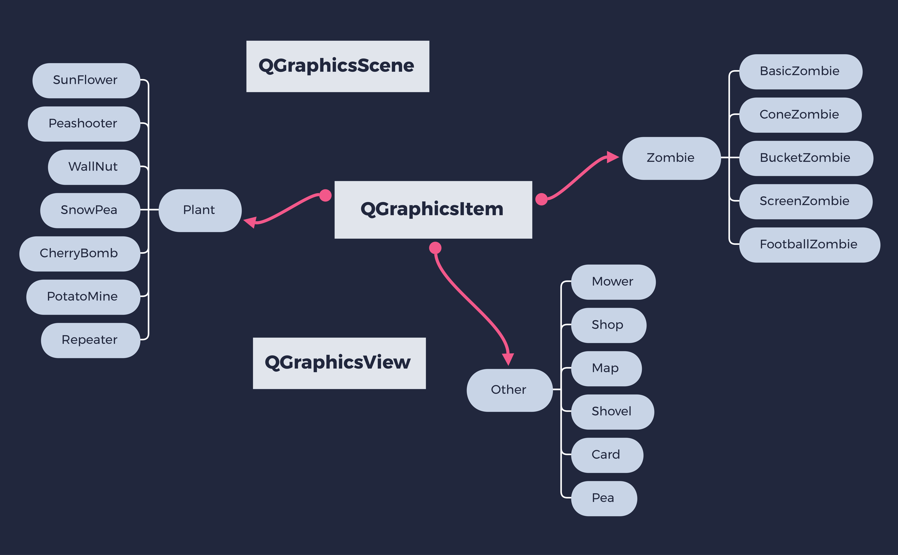

# 植物大战僵尸

## 实验目标

使用`C++`实现植物大战僵尸的`GUI`版本。


## 设计思路

### 架构设计

采用`Qt`的`Graphics View`框架，`Graphics View`框架提供了一个用于管理和交互大量定制的图形项`Item`的场景`Scene`，和一个用于可视化这些图形项`Item`的视图`View`。 

自定义的类体现封装、继承、多态的`OOP`思想，继承`QGraphicsItem`，分成三类：

1. 植物基类`Plant`，派生类包括向日葵`SunFlower`、豌豆射手`Peashooter`等。
2. 僵尸基类`Zombie`，派生类包括普通僵尸`BasicZombie`、路障僵尸`ConeZombie`等。
3. 其他基类`Other`，派生类包括商店`Shop`、地图`Map`、卡牌`Card`等。




### 界面设计

界面仿照原版植物大战僵尸，最上方是卡牌商店，商店右边是铲子，右上角是暂停继续按钮，界面中央是地图，植物和僵尸在此展开战斗，地图左边是割草机。

界面中的静态物体通过绘制`PNG`图片实现，动态物体通过绘制`GIF`图片的每一帧实现。


### Graphics View

`Graphics View`提供了一种基于`Item`的`Model-View`编程，多个`View`可以观察单个`Scene`，`Scene`中包含不同几何形状的`Item`。

`QGraphicsScene`提供了`Graphic View`的场景，场景有以下职责：

- 提供一个高性能的接口来管理大量的`Items`
- 将事件传播到每个`Item`
- 管理`Item`状态，如选择和焦点处理
- 提供未被变换的渲染能力，主要用于打印

`Scene`作为`QGraphicsItem`对象的容器，通过调用`addItem()`将`Item`添加到 `Scene`中。还有许多`Item`查找函数，`items()`有多个重载版本，可以返回返回由点、矩形、多边形或向量路径包含或相交的所有`Items`。

`QGraphicsView`提供了`View`组件，用于可视化场景中的内容。视图可以从键盘和鼠标接收事件，并将这些事件转换为场景事件（同时将坐标转换为场景坐标），然后将其发送给场景。

`QGraphicsItem`是场景中图形项`Item`的基类，支持以下功能：

- 鼠标按下，移动，释放和双击事件
- 键盘输入焦点和按键事件
- 拖放
- 碰撞检测

`Item`有许多重要函数，`boundingRect()`返回图形项的边界矩形，`paint()`用于绘制图形，为了实现碰撞检测，可以重写`shape()`返回的`Item`形状，或者重写`collidesWith()`实现自定义碰撞检测。  


### 植物设计

植物的属性包括：

* 生命值`hp`，用于判定死亡
* 状态`state`，用于记录状态
* 攻击力`atk`，用于造成伤害
* 计数器`counter`，用于计时
* 时间间隔`time`，用于判定是否行动
* 动画`movie`，用于加载`GIF`

植物的函数包括：

* `boundingRect()`，返回植物的边界矩形
* `paint()`，绘制植物
* `collidesWithItem()`，判定是否碰撞
* `advance()`，根据计数器和状态，进行碰撞检测，完成行动和状态转移
* `setMovie()`，设置动画的方便接口


### 僵尸设计

僵尸的属性包括：

* 生命值`hp`，用于判定死亡
* 状态`state`，用于记录状态
* 攻击力`atk`，用于造成伤害
* 速度`speed`，用于移动
* 动画`movie`，用于绘制`GIF`
* 动态`head`，用于绘制死亡僵尸头部`GIF`

僵尸的函数包括：

* `boundingRect()`，返回僵尸的边界矩形
* `paint()`，绘制僵尸
* `collidesWithItem()`，判定是否碰撞
* `advance()`，根据状态，进行碰撞检测，完成行动和状态转移
* `setMovie()`，设置动画的方便接口


### 其他设计

其他基类的派生类较多，根据需要具体实现。


## 具体实现

这部分列举了一些重要的类的具体实现，未列举的类可以同理实现。

### MainWindow

`MainWindow`控制整个游戏的运行，具体流程为：

1. 播放背景音乐
2. 创建场景，设置边界
3. 创建商店、卡牌、铲子、地图、割草机，加入场景
4. 创建视图，设置背景和大小
5. 创建计时器，将计时器事件`timeout()`绑定到场景`advance()`
6. 将计时器事件绑定到僵尸生成函数`addZombie()`和胜负判断函数`check()`


### Plant

`Plant`是植物基类，给出了植物相关函数的通用实现，如果派生类需要，可以重写函数。

```c++
// 返回便捷矩形
QRectF Plant::boundingRect() const
{
    return QRectF(-35, -35, 70, 70);
}
// 绘制图形
void Plant::paint(QPainter *painter, const QStyleOptionGraphicsItem *option, 					QWidget *widget)
{
    Q_UNUSED(option)
    Q_UNUSED(widget)
    // 绘制GIF的当前帧
    painter->drawImage(boundingRect(), movie->currentImage());
}
// 碰撞检测
bool Plant::collidesWithItem(const QGraphicsItem *other, 
                             Qt::ItemSelectionMode mode) const
{
    Q_UNUSED(mode)
    // 左右30像素内是否存在僵尸
    return other->type() == Zombie::Type 
        && qFuzzyCompare(other->y(), y()) 
        && qAbs(other->x() - x()) < 30;
}
// 设置GIF
void Plant::setMovie(QString path)
{
    if (movie)
        delete movie;
    // 设置GIF并播放
    movie = new QMovie(path);
    movie->start();
}
```


### Peashooter

`Peashooter`需要根据是否装弹完成以及是否存在僵尸，来决定是否发射子弹。

```c++
void Peashooter::advance(int phase)
{
    if (!phase)
        return;
    // 重绘
    update();
    // 死亡
    if (hp <= 0)
        delete this;
    // 装弹完成
    else if (++counter >= time)
    {
        counter = 0;
        // 检测到有僵尸
        if (!collidingItems().isEmpty())
        {
            // 发射子弹
            Pea *pea = new Pea(atk);
            pea->setX(x() + 32);
            pea->setY(y());
            scene()->addItem(pea);
            return;
        }
    }
}
```

为了方便地检测僵尸，重写碰撞检测函数。

```c++
bool Plant::collidesWithItem(const QGraphicsItem *other, 
                             Qt::ItemSelectionMode mode) const
{
    Q_UNUSED(mode)
    return other->type() == Zombie::Type 
        && qFuzzyCompare(other->y(), y());
}
```


### CherryBomb

`CherryBomb`有两个状态，准备状态和爆炸状态，分别记为0和1。

```c++
void CherryBomb::advance(int phase)
{
    if (!phase)
        return;
    update();
    if (hp <= 0)
        delete this;
    // 准备动画播放结束
    else if (state == 0 
             && movie->currentFrameNumber() == movie->frameCount() - 1)
    {
        state = 1;
        // 播放爆炸动画
        setMovie(":/images/Boom.gif");
        QList<QGraphicsItem *> items = collidingItems();
        foreach (QGraphicsItem *item, items)
        {
            Zombie *zombie = qgraphicsitem_cast<Zombie *>(item);
            zombie->hp -= atk;
            // 播放僵尸燃烧动画
            if (zombie->hp <= 0)
            {
                zombie->state = 3;
                zombie->setMovie(":/images/Burn.gif");
            }
        }
    }
    // 爆炸动画播放结束
    else if (state == 1 
             && movie->currentFrameNumber() == movie->frameCount() - 1)
        delete this;
}
```


### BasicZombie

`BasicZombie`是最普通的僵尸，可以作为许多僵尸的代表，有三种状态，行走，攻击，死亡，分别记为0，1，2。

```c++
void BasicZombie::advance(int phase)
{
    if (!phase)
        return;
    update();
    if (hp <= 0)
    {
        // 播放死亡动画
        if (state < 2)
        {
            state = 2;
            setMovie(":/images/ZombieDie.gif");
            setHead(":/images/ZombieHead.gif");
        }
        // 死亡动画播放结束
        else if (movie->currentFrameNumber() == movie->frameCount() - 1)
            delete this;
        return;
    }
    QList<QGraphicsItem *> items = collidingItems();
    if (!items.isEmpty())
    {
        // 攻击植物
        Plant *plant = qgraphicsitem_cast<Plant *>(items[0]);
        plant->hp -= atk;
        // 播放攻击动画
        if (state != 1)
        {
            state = 1;
            setMovie(":/images/ZombieAttack.gif");
        }
        return;
    }
    // 播放行走动画
    if (state)
    {
        state = 0;
        if (qrand() % 2)
            setMovie(":/images/ZombieWalk1.gif");
        else
            setMovie(":/images/ZombieWalk2.gif");
    }
    // 向前移动
    setX(x() - speed);
}
```


### Card

`Card`支持鼠标事件，需要重写鼠标按下、移动和松开函数。

```c++
// 鼠标移动事件
void Card::mouseMoveEvent(QGraphicsSceneMouseEvent *event)
{
    // 小于最小移动距离
    if (QLineF(event->screenPos(), 
               event->buttonDownScreenPos(Qt::LeftButton)).length()
            < QApplication::startDragDistance())
        return;
    // 传递拖放数据
    QDrag *drag = new QDrag(event->widget());
    QMimeData *mime = new QMimeData;
    QImage image(":/images/" + text + ".png");
    mime->setText(text);
    mime->setImageData(image);
    drag->setMimeData(mime);
    drag->setPixmap(QPixmap::fromImage(image));
    drag->setHotSpot(QPoint(35, 35));
    drag->exec();
    setCursor(Qt::ArrowCursor);
}
```

冷却未完成卡牌要变黑，可以根据已冷却时间在卡牌上画黑色矩形。

```c++
// 透明度为200
QBrush brush(QColor(0, 0, 0, 200));
painter->setBrush(brush);
// 根据冷却时间计算黑色矩形高度
painter->drawRect(QRectF(-48, -68, 98, 
                         132 * (1 - qreal(counter) / cool[map[text]])));
```


### Map

`Map`需要处理拖放事件，执行种植或铲除。

```c++
void Map::dropEvent(QGraphicsSceneDragDropEvent *event)
{
    if (event->mimeData()->hasText())
    {
        QString s = event->mimeData()->text();
        // 鼠标坐标到地块坐标
        QPointF pos = mapToScene(event->pos());
        pos.setX((int(pos.x()) - 249) / 82 * 82 + 290);
        pos.setY((int(pos.y()) - 81) / 98 * 98 + 130);
        // 铲子
        if (s == "Shovel")
        {
            // 铲除
            Shovel *shovel = qgraphicsitem_cast<Shovel *>
                (scene()->items(QPointF(830, 15))[0]);
            shovel->removePlant(pos);
        }
        else
        {
            // 种植
            Shop *shop = qgraphicsitem_cast<Shop *>
                (scene()->items(QPointF(300, 15))[0]);
            shop->addPlant(s, pos);
        }
    }
    update();
}
```


### Button

`Button`是控制游戏暂停和继续的按钮，需要重写鼠标按下事件。

```c++
void Button::mousePressEvent(QGraphicsSceneMouseEvent *event)
{
    // 鼠标左键
    if (event->button() == Qt::LeftButton)
    {
        if (timer->isActive())
        {
            sound->stop();
            timer->stop();
        }
        else
        {
            sound->play();
            timer->start();
        }
    }
    update();
} 
```


## 操作运行

操作方式跟原版游戏一致：

* 种植，拖动植物到地块
* 铲除，拖动铲子到地块
* 暂停/继续，按下右上角按钮


## 问题和解决方案

1. 有关`Graphics View`框架的中文资料稀缺且泛泛而谈，如何学习？

   阅读`Qt`英文文档，学习两个官方`Example`，分别实现拖放和碰撞，从而入门。

   
   
2. 在不支持可视化编程的框架下如何高效开发？

   必须对`Qt`有较深入了解，并且对每个物体的坐标心中有数，反复调试。
